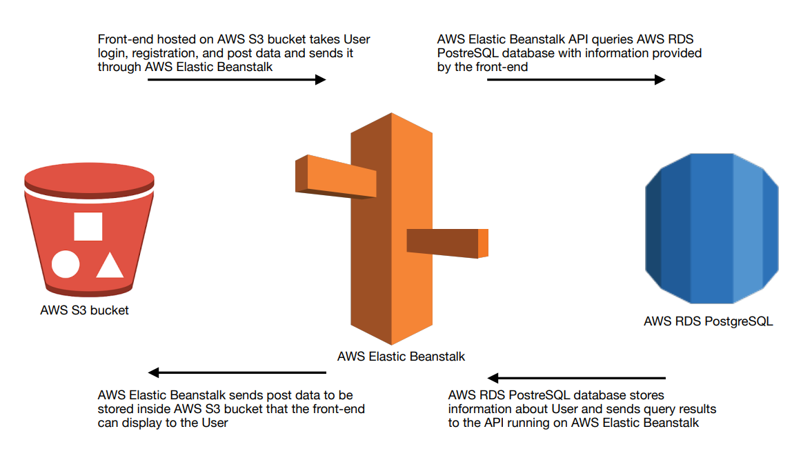
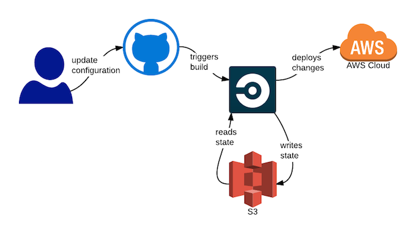

# documentation

## Infrastructure

- This application, Udagram, is composed of a frontend and backend: udagram-frontend and
  udagram-api.
- udagram-frontend is an Angular application hosted in an S3 bucket by Amazon Web Services.
- udagram-api is an Express application that lives inside an Elastic Beanstalk environment by
  Amazon Web Services.
- There is also a PostgreSQL database that lives inside RDS by Amazon Web Services

## Pipeline Description

- This application’s repository is monitored by CircleCI, so any time a code commit is pushed to
- the master branch of this application’s repository (udagram-udacity) the CircleCI pipeline is
- triggered, and a series of events are executed.

### This series of CircleCI pipeline events include

      . a Docker container is set up
      . NodeJS is set up inside the container
      . Dependencies are installed
      . AWS command line interfaces are set up
      . Environment secrets are read from inside CircleCI
      . The front-end dependencies are installed
      . The front-end is built
      . The back-end dependencies are installed
      . The back-end is built
      . The back-end is deployed to Elastic Beanstalk inside AWS
      . The front-end is deployed to S3 inside AWS

## Dependencies

### Front-end

      "dependencies": {
        "@angular/common": "^8.2.14",
        "@angular/core": "^8.2.14",
        "@angular/forms": "^8.2.14",
        "@angular/http": "^7.2.16",
        "@angular/platform-browser": "^8.2.14",
        "@angular/platform-browser-dynamic": "^8.2.14",
        "@angular/router": "^8.2.14",
        "@ionic-native/core": "^5.0.0",
        "@ionic-native/splash-screen": "^5.0.0",
        "@ionic-native/status-bar": "^5.0.0",
        "@ionic/angular": "^4.1.0",
        "core-js": "^2.5.4",
        "rxjs": "~6.5.4",
        "zone.js": "~0.9.1"
      },

### Back-end

      "dependencies": {
        "@types/bcryptjs": "2.4.2",
        "@types/jsonwebtoken": "^8.3.2",
        "aws-sdk": "^2.429.0",
        "bcryptjs": "2.4.3",
        "body-parser": "^1.18.3",
        "cors": "^2.8.5",
        "dotenv": "^8.2.0",
        "email-validator": "^2.0.4",
        "express": "^4.16.4",
        "jsonwebtoken": "^8.5.1",
        "pg": "^8.7.1",
        "reflect-metadata": "^0.1.13",
        "sequelize": "^5.21.4",
        "sequelize-typescript": "^0.6.9"
      },

## aws Flow

## circleci Flow

